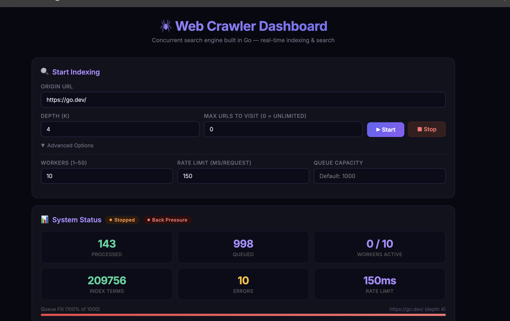

# Web Crawler & Search Engine

**GitHub Repository:** https://github.com/itu-itis23-elhan22/crawler

**Project Demo (YouTube):** [https://youtu.be/Ev6KNhs1c38](https://youtu.be/Ev6KNhs1c38)

## Dashboard Preview


A concurrent web crawler and real-time search engine built in Go. Crawls web pages from a starting URL up to a configurable depth, builds an inverted index, and provides keyword-based search with relevancy ranking — all while indexing is still active.

## How to Run

```bash
# Clone the repository
git clone https://github.com/itu-itis23-elhan22/crawler
cd crawler

# Build and run
go run main.go

# Dashboard available at http://localhost:8080
```

Requirements: Go 1.21+. No Docker, no external services — runs entirely on localhost.

If port 8080 is already in use from a previous session:
```bash
kill $(lsof -ti :8080)
```

## Architecture

The system is split into five focused packages:

| Package | Responsibility |
|---------|---------------|
| `crawler/` | Worker pool, task orchestration, pause/resume, log buffer |
| `index/` | Thread-safe inverted index with TF-based relevancy scoring |
| `crawler/fetcher.go` | HTTP client with timeout and content-type filtering |
| `crawler/parser.go` | Regex-based link extraction and word tokenization |
| `storage/` | Gob-based persistence with atomic writes and auto-save |
| `ui/` | HTTP API handlers and HTML dashboard template |

## How It Works

### Indexing (`POST /index`)

1. User submits an origin URL and depth `k` via the dashboard
2. The origin URL is placed in a buffered channel (default capacity: 1000)
3. A pool of worker goroutines (default: 10) pull tasks from the queue
4. Each worker: checks visited set → fetches page → parses HTML → updates inverted index → enqueues new links
5. **Back pressure**: when the queue is full, new URLs are dropped with a log entry (non-blocking send)
6. Optional `max_urls` limit stops the crawl after N pages regardless of depth

### Searching (`GET /search`)

- Query is split into terms, each term is looked up in the inverted index (read lock)
- Scores are accumulated per URL across all query terms
- Results are returned as `(relevant_url, origin_url, depth)` triples, sorted by score
- Search works concurrently with active indexing — `sync.RWMutex` allows parallel reads

### Pause / Resume

- Active crawl can be paused without cancelling the context
- Workers block on a shared channel when paused; resume unblocks them instantly
- Dashboard shows a "Paused" badge and toggles the Pause/Resume button accordingly

### Persistence (Bonus)

- Index and visited set are saved to `./crawl_data/` every 10 seconds using `encoding/gob`
- Atomic write via temp file + rename prevents corruption on crash
- State is restored automatically on next startup — crawl history is preserved

## API Reference

| Method | Endpoint | Description |
|--------|----------|-------------|
| `POST` | `/index` | Start a crawl. Body: `{"origin":"https://example.com","depth":2,"workers":10,"rate_limit_ms":200,"queue_size":1000,"max_urls":500}` |
| `DELETE` | `/index` | Stop the current crawl |
| `PATCH` | `/index?action=pause` | Pause the current crawl |
| `PATCH` | `/index?action=resume` | Resume a paused crawl |
| `GET` | `/search?query=go+programming&limit=50` | Search indexed pages. Returns `(relevant_url, origin_url, depth)` triples |
| `GET` | `/status` | Real-time system metrics (JSON) |
| `GET` | `/history` | List of past crawl jobs |
| `GET` | `/logs` | Current crawl log buffer (JSON) |
| `GET` | `/logs?format=text` | Download logs as plain text |
| `GET` | `/queue` | Current URL queue snapshot (JSON) |
| `GET` | `/queue?format=text` | Download queue as plain text |

## Concurrency & Thread Safety

| Shared Resource | Protection | Reason |
|----------------|-----------|--------|
| Visited set | `sync.Mutex` | Atomic check-and-mark prevents duplicate crawls |
| Inverted index | `sync.RWMutex` | Concurrent reads for search, exclusive writes for indexing |
| URL queue | Buffered `chan` | Inherently thread-safe; blocks/drops when full |
| Metrics (processed, errors, workers) | `sync/atomic` | Lock-free counter updates |
| Pause state | `sync/atomic` + `chan struct{}` | Workers block on channel; close unblocks all at once |
| Log buffer | `sync.Mutex` | Simple sequential append with ring-buffer eviction |

Verified with `go test -race ./...` — no data races detected.

## Back Pressure Mechanisms

1. **Queue depth limit** — Buffered channel with configurable capacity (default 1000). When full, new URLs are logged and dropped.
2. **Worker pool size** — Fixed number of goroutines limits parallel HTTP requests.
3. **Rate limiting** — Configurable delay between requests per worker (default 200ms).
4. **HTTP timeout** — 10-second per-request timeout prevents hanging on slow servers.
5. **Max URLs limit** — Optional hard cap on total pages visited per crawl session.
6. **10MB page size limit** — Prevents memory exhaustion from large pages.

## Relevancy Scoring

```
score = (term_count / total_words) * 100
      × (2.0 if term in page title)
      × (1.0 / (1 + depth × 0.1))
```

- **TF (Term Frequency)**: normalized — long and short pages are comparable
- **Title Boost**: 2× multiplier when the search term appears in `<title>`
- **Depth Penalty**: pages closer to the origin score slightly higher

## Project Structure

```
crawler_submission/
├── main.go                    # Server setup, persistence, graceful shutdown
├── crawler/
│   ├── crawler.go             # Worker pool, pause/resume, log buffer, metrics
│   ├── fetcher.go             # HTTP client with timeout and size limit
│   ├── parser.go              # HTML link extraction and word tokenization
│   ├── parser_test.go         # Unit tests for parser functions
│   └── fetcher.go
├── index/
│   ├── index.go               # Inverted index, search, TF scoring
│   └── index_test.go          # Unit tests for index operations
├── models/
│   └── models.go              # Shared data structures (CrawlTask, SearchResult, etc.)
├── storage/
│   └── persistence.go         # Auto-save, gob serialization, atomic file writes
├── ui/
│   ├── handler.go             # HTTP handlers for all API endpoints
│   └── templates/
│       └── index.html         # Dashboard: indexing, search, status, logs
├── go.mod
├── readme.md                  # This file
├── product_prd.md             # Product requirements document
└── recommendation.md          # Production deployment recommendations
```

## Tech Stack

- **Language**: Go (standard library only + `golang.org/x/net/html`)
- **HTTP**: `net/http` for both crawling and serving the dashboard
- **Concurrency**: goroutines, channels, `sync.Mutex`, `sync.RWMutex`, `sync/atomic`
- **Persistence**: `encoding/gob` for binary serialization
- **No external frameworks**: No Colly, Scrapy, Goquery, or similar
